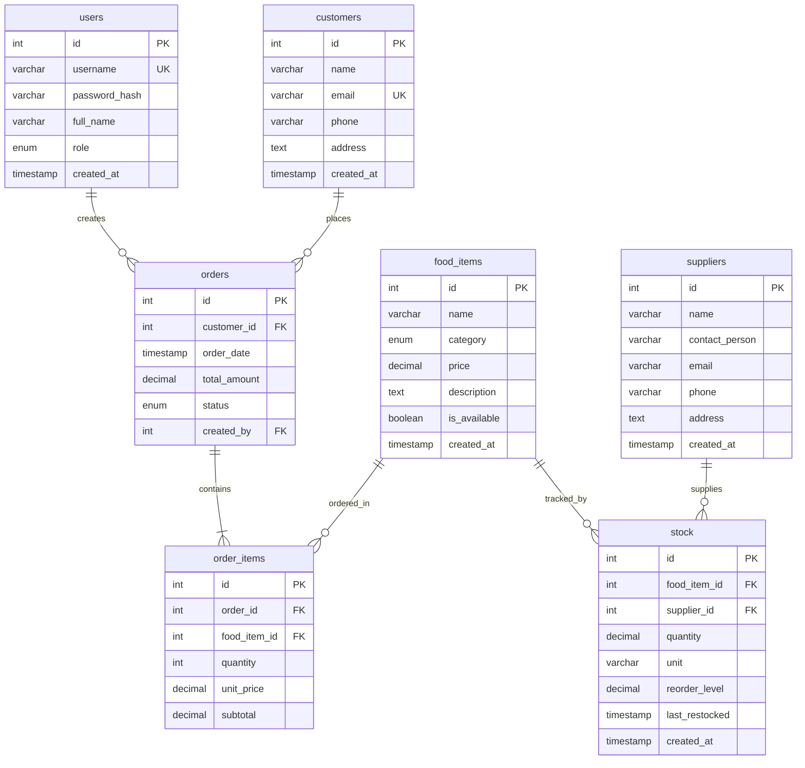
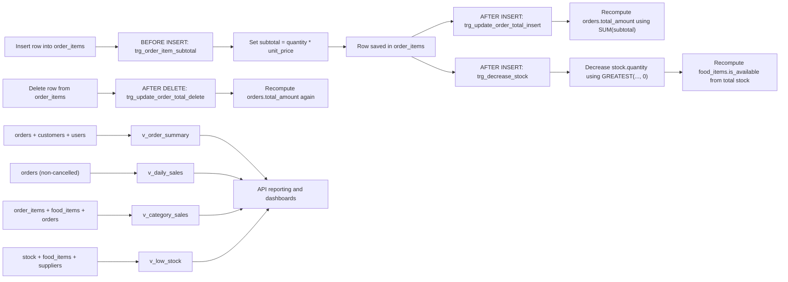

# Database Documentation

This document explains the database design for the Canteen Management System.

## Database Details

- Database name: `canteen_management`
- Engine: MySQL 8+
- Main schema file: `database/schema.sql`

## ER Diagram

## Tables Used

1. `users`
- Stores authentication and role information (`admin`, `staff`).

2. `customers`
- Stores customer contact details.

3. `food_items`
- Stores menu items, categories, pricing, and availability.

4. `suppliers`
- Stores supplier contact information.

5. `stock`
- Stores inventory per food item and optional supplier mapping.

6. `orders`
- Stores order header information including status and creator.

7. `order_items`
- Stores item-level lines for each order.

## SQL Features Used

1. DDL and schema management
- `CREATE DATABASE IF NOT EXISTS`
- `USE`
- `CREATE TABLE IF NOT EXISTS`
- `CREATE OR REPLACE VIEW`

2. Data types and domain modeling
- Numeric: `INT`, `DECIMAL`
- Text: `VARCHAR`, `TEXT`
- Date/time: `TIMESTAMP`
- Logical: `BOOLEAN`
- Controlled values using `ENUM`

3. Constraints and keys
- Primary keys (`PRIMARY KEY` with `AUTO_INCREMENT`)
- Foreign keys (`FOREIGN KEY ... REFERENCES ...`)
- Unique constraints (`UNIQUE`)
- Non-null constraints (`NOT NULL`)
- Defaults (`DEFAULT`)

4. Referential actions
- `ON DELETE CASCADE`
- `ON DELETE SET NULL`

5. Triggers
- `BEFORE INSERT` trigger to calculate `order_items.subtotal`
- `AFTER INSERT` trigger to refresh `orders.total_amount`
- `AFTER DELETE` trigger to refresh `orders.total_amount`
- `AFTER INSERT` trigger to decrease stock and update availability

6. Views for reporting
- `v_order_summary`
- `v_daily_sales`
- `v_category_sales`
- `v_low_stock`

7. SQL expressions/functions used
- `COALESCE`, `SUM`, `COUNT`, `DATE`, `NOW`, `GREATEST`, `CASE`

## Trigger Details

This section documents trigger name, usage, and join usage.

### 1. `trg_order_item_subtotal`

- Name: `trg_order_item_subtotal`
- Event and table: `BEFORE INSERT` on `order_items`
- Use: Auto-calculate each line subtotal at insert time.
- Core logic: `NEW.subtotal = NEW.quantity * NEW.unit_price`
- Join used: None (row-level calculation only).

### 2. `trg_update_order_total_insert`

- Name: `trg_update_order_total_insert`
- Event and table: `AFTER INSERT` on `order_items`
- Use: Recompute `orders.total_amount` when a new order item is added.
- Core logic:
  - Aggregates `SUM(subtotal)` for `NEW.order_id` from `order_items`.
  - Uses `COALESCE(..., 0)` so the total never becomes `NULL`.
- Join used: None (correlated aggregate subquery on `order_items`, then `UPDATE` on `orders`).

### 3. `trg_update_order_total_delete`

- Name: `trg_update_order_total_delete`
- Event and table: `AFTER DELETE` on `order_items`
- Use: Recompute `orders.total_amount` when an order item is removed.
- Core logic:
  - Re-aggregates remaining `SUM(subtotal)` for `OLD.order_id`.
  - Falls back to `0` when no order items remain.
- Join used: None (correlated aggregate subquery on `order_items`, then `UPDATE` on `orders`).

### 4. `trg_decrease_stock`

- Name: `trg_decrease_stock`
- Event and table: `AFTER INSERT` on `order_items`
- Use: Reduce inventory and update item availability after each sold item row.
- Core logic:
  - Updates `stock.quantity` using `GREATEST(quantity - NEW.quantity, 0)`.
  - Updates `food_items.is_available` using a stock sum check (`SUM(s.quantity) > 0`).
- Join used: None in explicit SQL join syntax. Uses a filtered subquery on `stock` (`FROM stock s WHERE s.food_item_id = NEW.food_item_id`).

## View Details

This section documents view name, usage, and exact joins.

### 1. `v_order_summary`

- Name: `v_order_summary`
- Use: Single-row order summary for API list pages and dashboard cards.
- Base table: `orders o`
- Joins used:
  - `LEFT JOIN customers c ON o.customer_id = c.id`
  - `LEFT JOIN users u ON o.created_by = u.id`
- Key output: order id/date, customer details, total, status, creator name.

### 2. `v_daily_sales`

- Name: `v_daily_sales`
- Use: Daily order and revenue aggregation for trend reporting.
- Base table: `orders o`
- Joins used: None.
- Key logic:
  - `GROUP BY DATE(o.order_date)`
  - Excludes cancelled orders (`o.status != 'cancelled'`)
  - Produces `COUNT(o.id)` and `SUM(o.total_amount)`

### 3. `v_category_sales`

- Name: `v_category_sales`
- Use: Category-level sales volume and revenue analysis.
- Base table: `order_items oi`
- Joins used:
  - `JOIN food_items fi ON oi.food_item_id = fi.id`
  - `JOIN orders o ON oi.order_id = o.id`
- Key logic:
  - Excludes cancelled orders (`o.status != 'cancelled'`)
  - Aggregates by `fi.category`

### 4. `v_low_stock`

- Name: `v_low_stock`
- Use: Operational alert view for restocking decisions.
- Base table: `stock s`
- Joins used:
  - `JOIN food_items fi ON s.food_item_id = fi.id`
  - `LEFT JOIN suppliers sup ON s.supplier_id = sup.id`
- Key logic:
  - Filters on `s.quantity <= s.reorder_level`
  - Includes supplier info when available.

## Trigger and View Flow

Flow summary:

1. On `order_items` insert, subtotal is calculated first, then order total and stock are updated.
2. On `order_items` delete, order total is recalculated.
3. Views provide reusable read models for order summary, daily sales, category sales, and low-stock monitoring.

## Constraints in the Schema

### Primary Key Constraints

- `users.id`
- `customers.id`
- `food_items.id`
- `suppliers.id`
- `stock.id`
- `orders.id`
- `order_items.id`

### Unique Constraints

- `users.username` is unique.
- `customers.email` is unique.

### Foreign Key Constraints

- `stock.food_item_id` -> `food_items.id` (`ON DELETE CASCADE`)
- `stock.supplier_id` -> `suppliers.id` (`ON DELETE SET NULL`)
- `orders.customer_id` -> `customers.id` (`ON DELETE SET NULL`)
- `orders.created_by` -> `users.id` (`ON DELETE SET NULL`)
- `order_items.order_id` -> `orders.id` (`ON DELETE CASCADE`)
- `order_items.food_item_id` -> `food_items.id` (`ON DELETE CASCADE`)

### NOT NULL Constraints (Key Examples)

- `users.username`, `users.password_hash`, `users.full_name`, `users.role`
- `customers.name`
- `food_items.name`, `food_items.category`, `food_items.price`
- `suppliers.name`
- `stock.food_item_id`, `stock.quantity`, `stock.unit`
- `orders.total_amount`, `orders.status`
- `order_items.order_id`, `order_items.food_item_id`, `order_items.quantity`, `order_items.unit_price`, `order_items.subtotal`

### Default Constraints (Key Examples)

- Timestamp defaults: `created_at` and `order_date` use `CURRENT_TIMESTAMP`
- `users.role` defaults to `'staff'`
- `food_items.is_available` defaults to `TRUE`
- `stock.quantity` defaults to `0`
- `stock.unit` defaults to `'units'`
- `stock.reorder_level` defaults to `10`
- `orders.total_amount` defaults to `0`
- `orders.status` defaults to `'pending'`
- `order_items.quantity` defaults to `1`

### ENUM-Based Domain Constraints

- `users.role`: `admin`, `staff`
- `food_items.category`: `appetizer`, `main_course`, `dessert`, `beverage`, `snack`
- `orders.status`: `pending`, `preparing`, `ready`, `delivered`, `cancelled`

## Notes

- Business logic is partly enforced at the database layer through triggers.
- Reporting endpoints rely on pre-defined SQL views for faster and cleaner query logic.